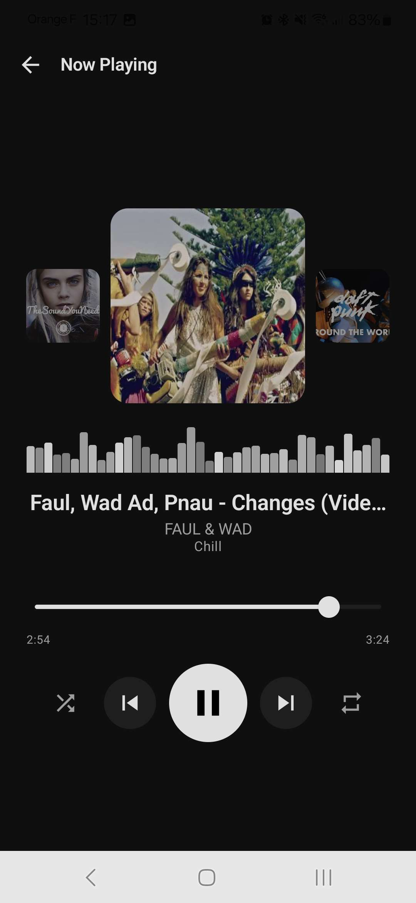
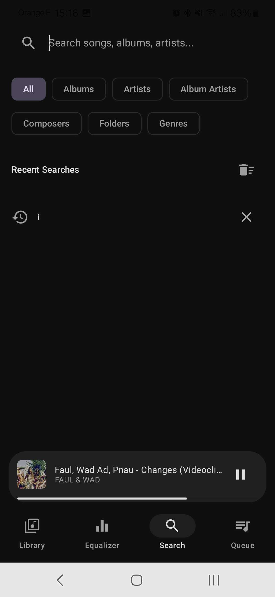
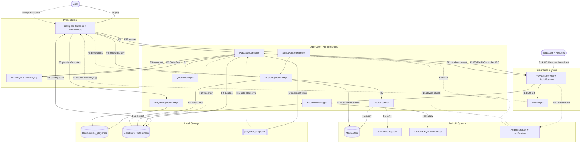

# Music Player

A modern Android music player for local audio files, built with Kotlin and Jetpack Compose. Browse your library by folder, album, artist, genre, year, or composer; play with a Media3/ExoPlayer-backed engine; tweak the sound with a 5-band EQ + bass boost; and pick up exactly where you left off thanks to a persistent queue and library cache.

## Screenshots

<p align="center">
  
  
  
</p>
<p align="center">
  
  
  
</p>

## Features

### Library
- Browse by **songs, folders, albums, artists, album artists, composers, genres, years**
- **Folder hierarchy** view for nested directory navigation
- **Custom scan folders** via SAF — pick any directory tree the app should index
- **Sort options** with 29 modes (title / artist / album / duration / date / size / track / disc / filename / year / genre / composer / format / shuffle); filename sort uses natural alphanumeric order so `7 - …` precedes `19 - …`
- **Alphabet fast scroller** on long lists
- **Auto-scroll** to the currently playing song when entering a list
- **Search** across every category with persisted search history

### Playback
- **Now Playing** screen with album-art carousel, seek bar, shuffle, and repeat (off / all / one)
- **Horizontal swipe** on the artwork skips tracks; clamped at queue edges (respects repeat-all)
- **Seek-while-paused** auto-resumes playback on release
- **Persistent queue** — queue, index, and source route are saved to DataStore *and* a synchronous SharedPreferences snapshot, so the MiniPlayer hydrates immediately on process restart (no flicker)
- **Folder continuation** — optionally chain into the next folder when a queue ends (toggle in Settings)
- **5-band Equalizer** + Bass Boost with presets, persisted to DataStore
- **Notification controls** with album art in the notification shade
- **Bluetooth / wired headset** auto-resume; resilient to BT disconnect via `onEvents` reconciliation

### Library management
- **Library cache** — scanned songs are persisted to Room so the UI populates instantly on startup; a fresh MediaStore scan runs once per foreground session and writes back. **No background workers** — the cache costs no energy when the app is closed
- **Safe delete** — long-press a song → delete with Android R+ system confirmation, automatic queue eviction, and Snackbar feedback
- **Playlists & Favorites** — create playlists, mark favorites, all stored in Room

### System integration
- **Keep Screen On** toggle in Settings (only holds the wake flag while the activity is foregrounded — phone honors normal standby otherwise)
- **Lock-screen controls** via MediaSession
- **Per-song embedded artwork** decoded by jAudioTagger and rendered through a custom Coil fetcher

## Tech Stack

| Layer | Libraries |
|-------|-----------|
| UI | Jetpack Compose, Material 3, Compose Navigation, Coil |
| Playback | Media3 / ExoPlayer, AudioFX Equalizer + BassBoost |
| Data | Room, DataStore (Preferences), MediaStore, jAudioTagger, SAF DocumentFile |
| DI | Hilt |
| Language | Kotlin, Coroutines + Flow |

**Min SDK**: 26 (Android 8) &bull; **Target SDK**: 34 (Android 14) &bull; **Java**: 17

## Build

```bash
./gradlew assembleDebug        # debug APK
./gradlew assembleRelease      # release APK (R8 minified + resource shrunk)
./gradlew clean                # clean build outputs
```

Output APKs are in `app/build/outputs/apk/`.

The release build is signed with the standard Android debug keystore so the APK can be sideloaded directly. Replace `signingConfigs.release` in `app/build.gradle.kts` with a proper keystore before publishing to the Play Store.

This is a single-module Gradle project (`:app`). There are no tests configured. Dependency versions are centralized in `gradle/libs.versions.toml`.

## Permissions

| Permission | Why |
|------------|-----|
| `READ_MEDIA_AUDIO` (API 33+) / `READ_EXTERNAL_STORAGE` | Discover audio files via MediaStore |
| `FOREGROUND_SERVICE` + `FOREGROUND_SERVICE_MEDIA_PLAYBACK` | Run `PlaybackService` while playing |
| `POST_NOTIFICATIONS` (API 33+) | Show the media notification |
| SAF (no permission entry) | User-granted persistent URI for custom scan folders |

## Architecture

Clean Architecture with three layers, all under `com.musicplayer.app`:

```
┌─────────────────────────────────────────┐
│  UI (Compose screens + ViewModels)      │
├─────────────────────────────────────────┤
│  Domain (models, repository interfaces) │
├─────────────────────────────────────────┤
│  Data (Room, MediaStore, DataStore)     │
└─────────────────────────────────────────┘
```

### Flux diagram

Data/control flows are grounded in source and tracked as `F1..F18` in
[`docs/architecture-fluxes.md`](docs/architecture-fluxes.md) (the master list). The editable
diagram is [`docs/architecture.drawio`](docs/architecture.drawio); the topology below is the
[`docs/architecture.mmd`](docs/architecture.mmd) source rendered inline.



> The `.drawio` is the editable source; the inline Mermaid is the at-a-glance view. Long
> cross-perimeter edges in the `.drawio` (e.g. the scanner reaching system services) are routed
> as a draw.io-GUI refinement — re-import the `.mmd` via *Extras -> Edit Diagram -> Mermaid* after
> topology changes. Keep the `F#` identical across the `.mmd`, the `.drawio`, and the flux list.

- **`domain/`** — Pure Kotlin. `Song`, `Album`, `Artist`, `Folder`, `Playlist`, `Genre`, `Year`, `Composer`, `SortOption`, `DeleteResult`. Repository interfaces (`MusicRepository`, `PlaylistRepository`) and `SortSongsUseCase`.
- **`data/`** — `MusicRepositoryImpl` (in-memory `MutableStateFlow<List<Song>>` + Room `cached_songs` snapshot), `PlaylistRepositoryImpl`, `MediaScanner`, Room database (v3), DAOs.
- **`player/`** — `PlaybackController`, `QueueManager`, `SongDeletionHandler`, `PlaybackService` (`MediaSessionService`), `EqualizerManager`. All `@Singleton`, Hilt-injected.
- **`di/`** — `AppModule`, `DatabaseModule`, `RepositoryModule` — all `@InstallIn(SingletonComponent::class)`.
- **`ui/`** — Compose screens by feature, reusable components (`SongItem`, `MiniPlayer`, `SortMenu`, `AlbumArtImage`, `AlphabetFastScroller`, `EqBandSlider`, `RotaryKnob`, etc.), `Screen` sealed class for routes, Material 3 theme.

```
app/src/main/java/com/musicplayer/app/
├── MainActivity.kt          Entry point, permission handling, keep-screen-on flag observer
├── MusicPlayerApp.kt        @HiltAndroidApp, Coil image loader config
├── domain/                  Models, repository interfaces, use cases
├── data/                    Repository implementations, Room DB, MediaScanner
├── di/                      Hilt modules
├── player/                  Playback singletons + foreground service
└── ui/
    ├── components/          SongItem, MiniPlayer, SortMenu, ...
    ├── navigation/          Screen sealed class + NavGraph
    ├── screens/             library, nowplaying, equalizer, search, queue, ...
    └── theme/               Colors, typography, Material theme
```

### Library cache (zero-energy when closed)

The library cache is designed so the app feels instant on launch *without* any background work:

1. On first `refreshLibrary()` per process, hydrate the in-memory `StateFlow<List<Song>>` from the Room `cached_songs` table — UI populates immediately.
2. Run a fresh `MediaScanner` pass once per foreground session, then `cachedSongDao.replaceAll(...)` writes the new snapshot back atomically.
3. Subsequent calls are no-ops unless `force = true` (passed by Settings rescan and folder add/remove).

There is **no `WorkManager`, no `JobScheduler`, no `AlarmManager`, and no broadcast receiver** for the cache. When the app is not in the foreground, the cache costs nothing.

### Database

Room database `music_player.db`, version 3:

| Table | Purpose |
|-------|---------|
| `playlists` | User-created playlists |
| `playlist_songs` | Join table (playlist ↔ song) |
| `favorites` | Favorited song IDs |
| `search_history` | Recent queries (limit 20) |
| `cached_songs` | Persistent library snapshot (read on startup, replaced per scan) |

Migrations: v1→v2 added `search_history`; v2→v3 added `cached_songs`.

## Documentation

Deeper reference for working on specific areas — start in [`docs/`](docs/):

| Doc | Covers |
|-----|--------|
| [`ARCHITECTURE.md`](docs/ARCHITECTURE.md) | Layers, playback system, DI, UI overview |
| [`FILE_MAP.md`](docs/FILE_MAP.md) | Every source file with its purpose, fields, and methods |
| [`DATABASE.md`](docs/DATABASE.md) | Room schema, DAO methods, how to add a new table |
| [`DATA_FLOW.md`](docs/DATA_FLOW.md) | How data flows from MediaStore/Room/DataStore through DI to the UI |
| [`NAVIGATION.md`](docs/NAVIGATION.md) | All routes, parameters, and how to add new screens |
| [`VIEWMODELS.md`](docs/VIEWMODELS.md) | Every ViewModel with state, methods, and injection patterns |
| [`PLAYBACK.md`](docs/PLAYBACK.md) | Playback system architecture and common patterns |

## License

No license declared yet.
