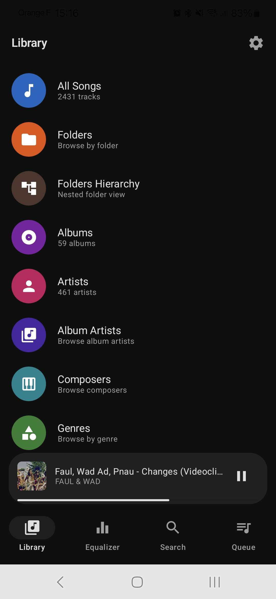
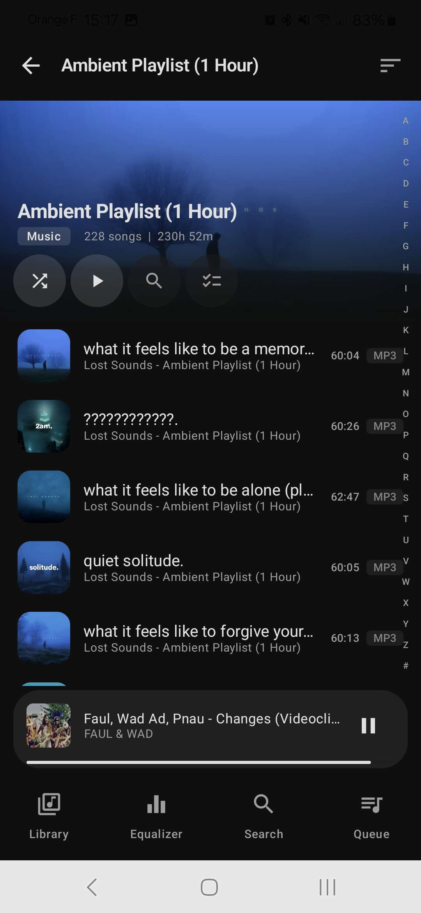
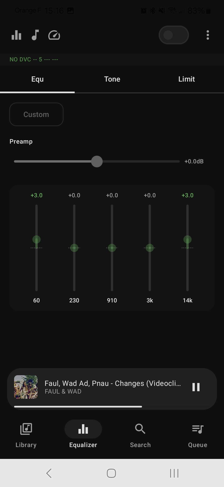
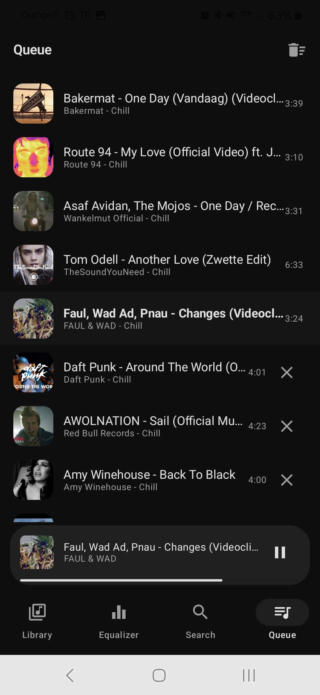

# Music Player

A modern Android music player for local audio files, built with Kotlin and Jetpack Compose.

## Screenshots

<p align="center">
  
  
  
</p>
<p align="center">
  
  
  
</p>

## Features

- **Library** -- browse by songs, folders, albums, artists, album artists, composers, genres, and years
- **Folder hierarchy** -- navigate your music folders with a nested folder view
- **Now Playing** -- album art carousel, seek bar, shuffle and repeat controls
- **Equalizer** -- 5-band EQ with bass boost, presets, and per-band sliders
- **Queue** -- view and manage your playback queue with drag-to-reorder
- **Search** -- search across all categories with search history
- **Playlists & Favorites** -- create playlists and mark favorite tracks
- **Notification controls** -- media controls with album art in the notification shade
- **Bluetooth / headset support** -- auto-resume on Bluetooth or headset connection
- **Persistent queue** -- automatically restores your queue and position on app restart
- **Folder continuation** -- optionally continue playback into the next folder when a queue ends

## Tech Stack

| Layer | Libraries |
|-------|-----------|
| UI | Jetpack Compose, Material 3, Compose Navigation, Coil |
| Playback | Media3 / ExoPlayer, AudioFX Equalizer + BassBoost |
| Data | Room, DataStore, MediaStore, jAudioTagger |
| DI | Hilt |
| Language | Kotlin, Coroutines + Flow |

**Min SDK**: 26 (Android 8) &bull; **Target SDK**: 34 (Android 14) &bull; **Java**: 17

## Build

```bash
./gradlew assembleDebug        # debug APK
./gradlew assembleRelease      # release APK (minified + shrunk)
```

Output APKs are in `app/build/outputs/apk/`.

## Project Structure

```
app/src/main/java/com/musicplayer/app/
├── domain/          Models, repository interfaces, use cases
├── data/            Repository implementations, Room DB, MediaScanner
├── di/              Hilt modules (AppModule, DatabaseModule, RepositoryModule)
├── player/          PlaybackController, QueueManager, PlaybackService, EqualizerManager
└── ui/
    ├── components/  Reusable composables (SongItem, MiniPlayer, SortMenu, etc.)
    ├── navigation/  Screen sealed class + NavGraph
    ├── screens/     Feature screens (library, nowplaying, equalizer, search, queue, ...)
    └── theme/       Colors, typography, Material theme
```

For full architecture details, see [ARCHITECTURE.md](ARCHITECTURE.md).
